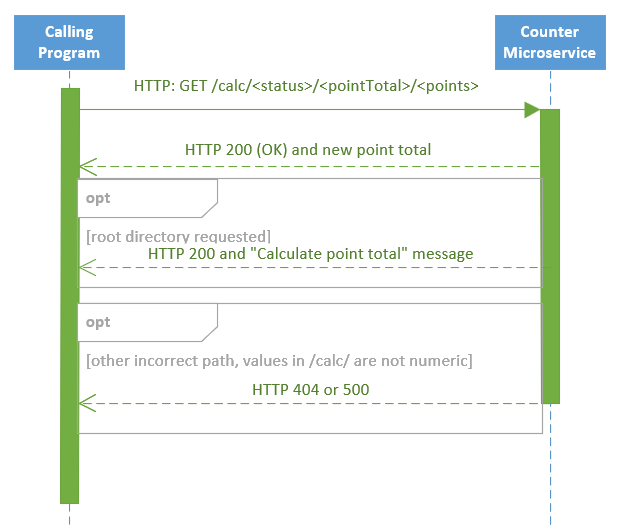

# Counter microservice for task-tracking system

This is a simple counter microservice for the task management system project 

## Launching

Start the microservice by running:
`python3 ./counter.py [port_no]`
*Note: port_no is optional; omitting it will use the default port of 56789.*

## Requesting a point update

Make an HTTP GET request to your local system (see above for port number) at `/calc/<status>/<pointTotal>/<points>`, where:

- `status` is the completion status of the task (e.g. `"Complete"` or `"Earned"`)
- `pointTotal` is the user's current point total as an integer
- `points` is the value or cost of a task or reward, respectively

### Responses

On success, the response will be a 200 OK with the body containing the new total score in plaintext.
If the path is incorrect, a 404 Not Found response will be returned.
If `pointTotal` or `points` is not a number, a 500 Internal Server Error response will be returned.

## UML diagram

